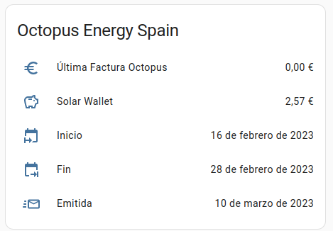

# Componente Octopus Spain para Home Assistant

## ¿Qué es Octopus Energy?

[Octopus Energy](https://octopusenergy.es/) es una comercializadora eléctrica española.

Entre otras ventajas, dispone de la **Solar Wallet**, un servicio que permite acumular crédito obtenido
por los excedentes solares para reducir a 0€ la factura así como acumular para posteriores facturas.


## ¿Qué hace el componente Octopus Spain?

Este componente conecta con tu cuenta de _Octopus Energy_ para obtener el estado actual de tu **Solar Wallet** 
así como los datos básicos de última factura.

Este componente ha sido revisado por los ingenerios de _Octopus Energy_ y ha recibido su visto bueno.

## Instalación

Puedes instalar el componente usando HACS:

### Directa usando _My Home Assistant_
[](https://my.home-assistant.io/redirect/hacs_repository/?owner=miguelangellv&repository=octopus_spain&category=integration)


### Manual
```
HACS -> Integraciones -> Tres puntitos -> Repositorios Personalizados
```
Copias la URL del reposotiro ( https://github.com/MiguelAngelLV/octopus_spain ), como categoría seleccionas _Integración_ y pulsas en _Añadir_.


## Configuración

Una vez instalado, ve a _Dispositivos y Servicios -> Añadir Integración_ y busca _Octopus_.

El asistente te solicitará tu email y contraseña de [Octopus Energy](https://octopusenergy.es/)


## Entidades
Una vez configurado el componente, tendrás dos entidades por cada cuenta que tengas asociada a tu email (normalmente una).

### Solar Wallet
La entidad Solar Wallet devuelve el valor actual de tu Solar Wallet. Este valor (en euros) estará actualizado al de tu última factura. Actualmente no se puede consultar en tiempo real.

## Octopus Credit
La entidad Octopus Credit devuelve el valor actual de tu crédito en Octopus obtenido por cuentas referedidas u otras posibles bonificaciones.

### Última Factura
Esta entidad devuelve el coste de tu última factura.

Adicionalmente, en los atributos, están disponibles las fechas de emisión de esa factura así el periodo (inicio y final) de la misma.


## Uso

Podrás usar estas etidades para visualizar el estado así como crear automatizaciones para informate, por ejemplo, 
cuando se produzca un cambio en el atributo "Emitida" de última fáctura.


Una forma de representar los datos sería esta:

```yaml
title: Octopus Spain
type: entities
entities:
  - entity: sensor.ultima_factura_octopus
  - entity: sensor.solar_wallet
  - entity: sensor.octopus_credit
  - type: attribute
    entity: sensor.ultima_factura_octopus
    name: Inicio
    icon: mdi:calendar-start
    attribute: Inicio
  - type: attribute
    entity: sensor.ultima_factura_octopus
    name: Fin
    icon: mdi:calendar-end
    attribute: Fin
  - type: attribute
    entity: sensor.ultima_factura_octopus
    name: Emitida
    icon: mdi:email-fast-outline
    attribute: Emitida
```



## Videotutorial

[](http://www.youtube.com/watch?v=fJ1W_wACbfw)

